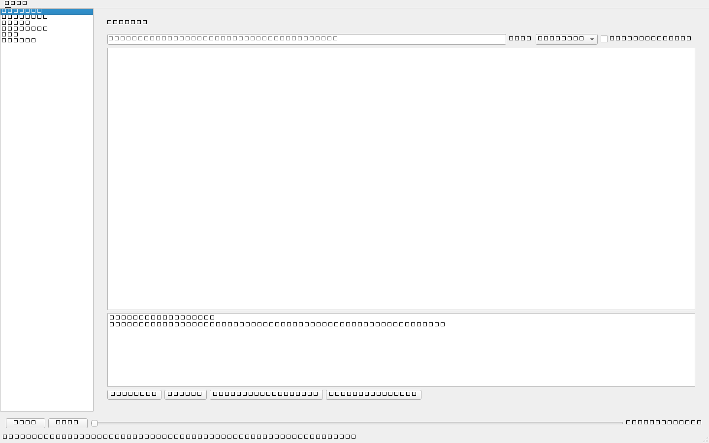
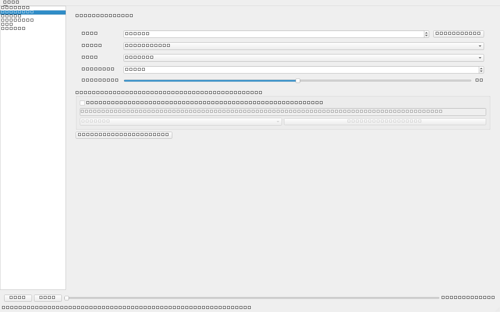
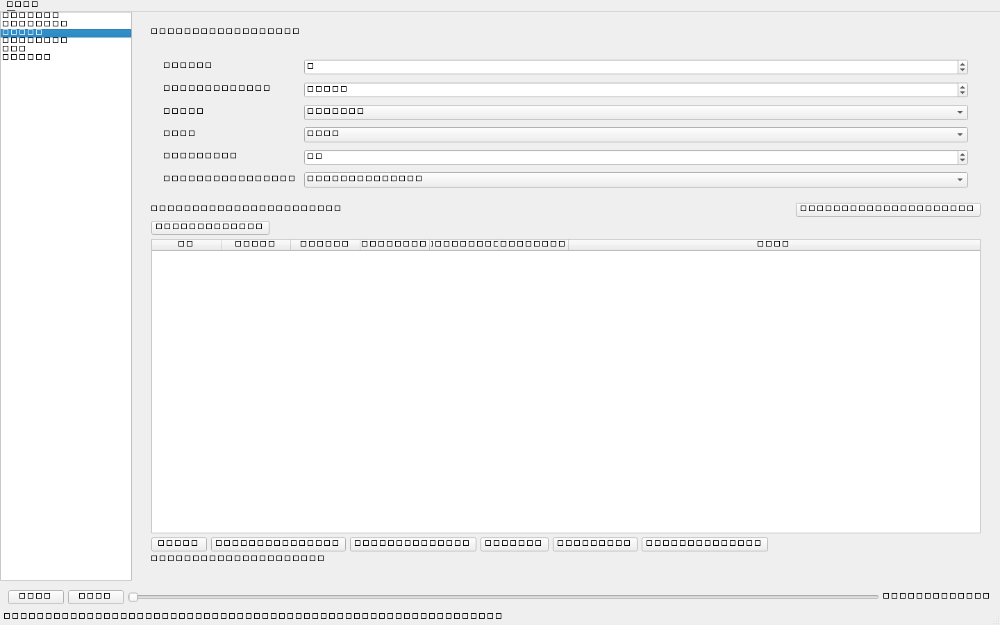
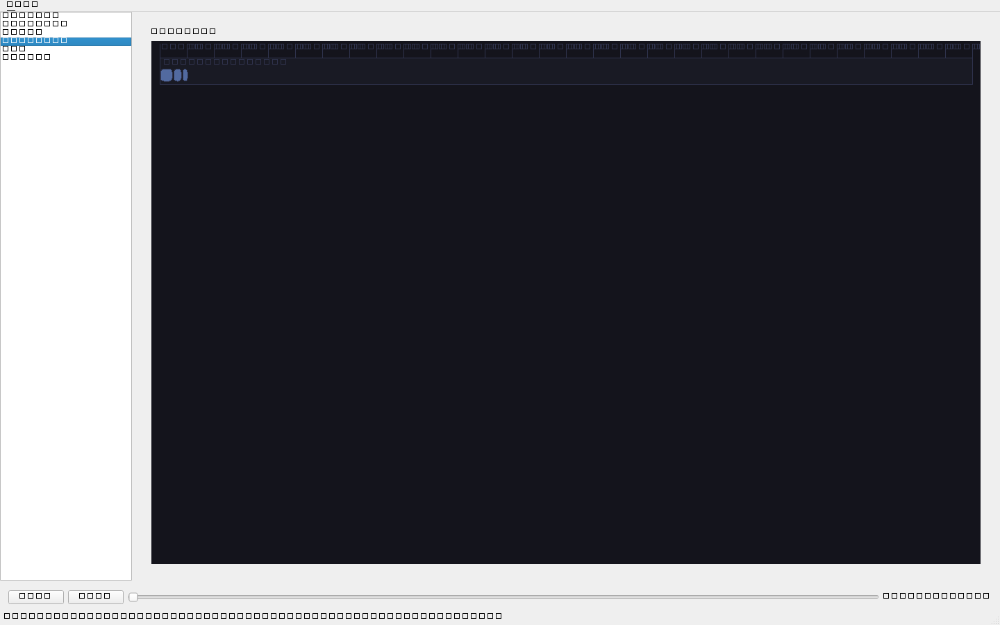
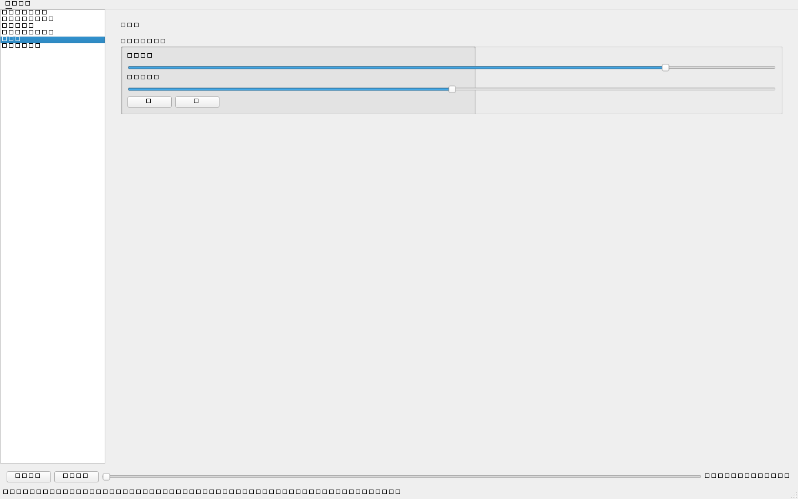
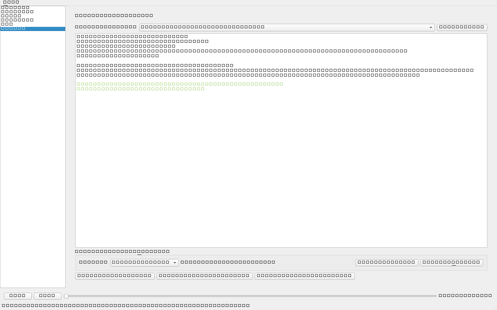

# LongForm Music Studio (LFMS)

Professional desktop application for creating **long-form background music**
(10–120+ minutes) for YouTube, documentary, educational, meditation and podcast
video creators. Offline-first, copyright-aware, built for Windows.

> **Status: v1.0.0 — all 14 roadmap phases complete.**
> The full MVP loop works end-to-end and is covered by 342 automated tests
> (unit, integration, performance budgets, crash-recovery drills, offscreen
> GUI). See [ROADMAP.md](ROADMAP.md) for the phase-by-phase record; features
> marked below reflect what exists today — nothing is claimed as working
> unless it is implemented and tested.

## What it does (target product)

- Generates original procedural background music from genre/mood/intensity presets
- Arranges 10–120+ minute tracks with anti-repetition variation (no obvious looping)
- Energy curves, intro/outro, transitions, voiceover-safe mixing with ducking
- Timeline editor, multi-track mixer, effects, mastering (LUFS-aware)
- Exports WAV / MP3 / FLAC / OGG with license & provenance certificates
- Library with search, tags, favorites; SQLite-backed projects and render queue

| Area | Status |
| --- | --- |
| Architecture & repo foundation | ✅ Done |
| Core: config, portable paths, logging/crash reports, seeds, IDs, SQLite schema + repository, backups | ✅ Implemented & unit-tested |
| Audio engine (oscillators, filters, ambiences, mixer graph, offline renderer, realtime player) | ✅ Phase 2 done |
| Procedural generator (plan → harmony/melody → audio, seed-reproducible) | ✅ Phase 3 done |
| Long-form arranger (sections, energy curves, repetition score) | ✅ Phase 4 done |
| Timeline model + undo/redo + PySide6 app shell (`python -m lfms.app`) | ✅ Phase 5 done |
| Mixer & effects (chains, presets, voiceover ducking, offline MixBus) | ✅ Phase 6 done |
| Mastering & QC (BS.1770 measurement, auto-master presets, QC gates) | ✅ Phase 7 done |
| Sound library (search/tags/favorites/collections, smart tagging, Library+Mix UI) | ✅ Phase 8 done |
| Provenance center + full export pipeline (render → master → QC → deliver, certificates, verification) | ✅ Phase 9 done — 279 tests |
| AI Music Director (optional, off by default: offline interpreter + local Ollama adapter, consent-gated) | ✅ Phase 10 done — 302 tests |
| Batch render queue (unique seeds, pause/cancel/retry/reorder, off-thread worker, perf monitor) | ✅ Phase 11 done — 312 tests |
| Installer & portable build (PyInstaller ZIP verified, Inno Setup script ready, release checklist) | ✅ Phase 12 done — 315 tests |
| Testing hardening (integration E2E per spec §71, performance budgets, crash-recovery drills) | ✅ Phase 13 done — 342 tests |
| v1.0.0 release (screenshots, portable ZIP rebuilt & self-verified, changelog, publish checklist) | ✅ Phase 14 done |

## Screenshots

Real captures of the running app (regenerate anytime with
`python scripts/make_screenshots.py` — renders headlessly via Qt offscreen).

| Library | Generate |
| --- | --- |
|  |  |

| Batch queue | Timeline |
| --- | --- |
|  |  |

| Mixer | Provenance |
| --- | --- |
|  |  |

## Download & run

- **Portable ZIP** (no install): grab
  `LongFormMusicStudio-<version>-portable.zip` from GitHub Releases, unzip,
  run `LongFormMusicStudio.exe`. Built and self-verified by
  `installer/build_portable.ps1` (see [docs/RELEASE.md](docs/RELEASE.md)).
- **Setup.exe**: `installer/setup.iss` builds an Inno Setup installer
  (requires ISCC.exe; not bundled with the repo).
- **From source**: see Development setup below, then `python -m lfms.app`.

## Copyright stance

LFMS only ever generates **original** music via its own synthesis engine.
Imported audio must be classified by the user (CC0, public domain, user-owned,
externally licensed); anything `UNKNOWN` or `RESTRICTED` shows a clear warning.
The app never relabels imported music as "copyright-free". See
[docs/LICENSING.md](docs/LICENSING.md).

## Development setup

Requirements: Windows 10/11, Python 3.10+, Git.

```powershell
git clone <repo-url> LongForm-Music-Studio
cd LongForm-Music-Studio
.\scripts\dev_setup.ps1        # creates .venv, installs deps, runs tests
```

Manual:

```powershell
python -m venv .venv
.\.venv\Scripts\python.exe -m pip install -U pip
.\.venv\Scripts\python.exe -m pip install -e ".[dev]"
.\.venv\Scripts\python.exe -m pytest
```

## Documentation

- [ARCHITECTURE.md](ARCHITECTURE.md) — full technical architecture
- [ROADMAP.md](ROADMAP.md) — phased development plan
- [docs/USER_GUIDE.md](docs/USER_GUIDE.md) · [docs/DEVELOPER_GUIDE.md](docs/DEVELOPER_GUIDE.md)
- [docs/AUDIO_ENGINE.md](docs/AUDIO_ENGINE.md) · [docs/LICENSING.md](docs/LICENSING.md) · [docs/TROUBLESHOOTING.md](docs/TROUBLESHOOTING.md)
- [docs/BATCH.md](docs/BATCH.md) · [docs/PROVENANCE.md](docs/PROVENANCE.md) · [docs/RELEASE.md](docs/RELEASE.md)

## License

MIT for LFMS code — see [LICENSE](LICENSE). Third-party dependencies keep their
own licenses ([THIRD_PARTY_LICENSES.md](THIRD_PARTY_LICENSES.md)).
